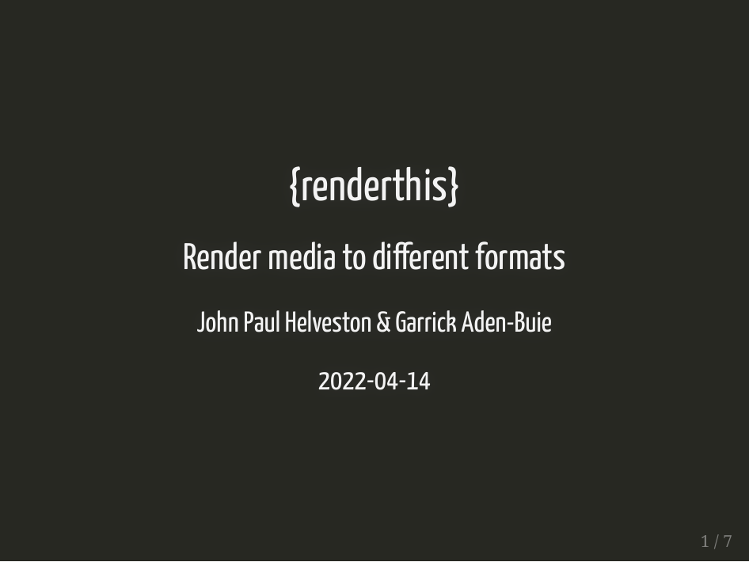
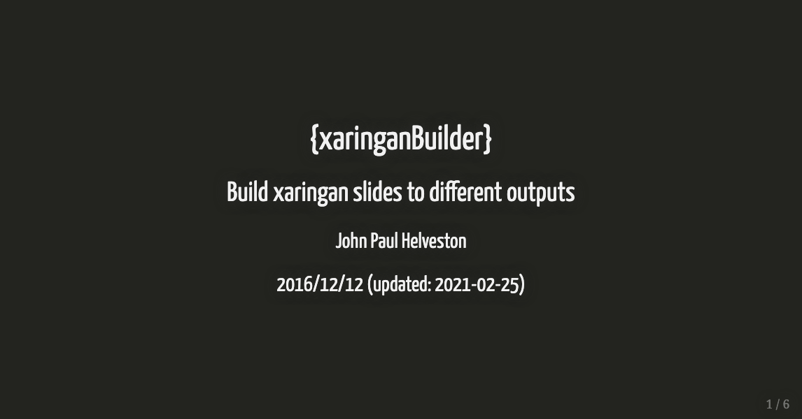

---
output:
  github_document:
    html_preview: false
---

<!-- README.md is generated from README.Rmd. Please edit that file -->

```{r setup, include = FALSE}
knitr::opts_chunk$set(
  collapse = TRUE,
  results = "asis",
  comment = "#>",
  out.width = "100%",
  eval = FALSE
)
IS_README <- TRUE
```

# renderthis <a href='https://jhelvy.github.io/renderthis/'></a>

<!-- badges: start -->
[](https://www.tidyverse.org/lifecycle/#experimental)
[](https://github.com/jhelvy/renderthis/actions)
<!-- badges: end -->

Render media to different formats:

FROM:

- Rmd / qmd
- html
- pdf
- pptx

TO:

- html
- pdf
- png
- gif
- pptx
- mp4

## Installation

You can install the current version of renderthis from GitHub:

```{r}
# install.packages("remotes")
remotes::install_github("jhelvy/renderthis")
```

Some output formats require additional packages, and each format will provide instructions about how to install any missing dependencies. You can also choose to install renderthis with all of its dependencies:

```{r}
# install.packages("remotes")
remotes::install_github("jhelvy/renderthis", dependencies = TRUE)
```

## Build hierarchy

Some output types depend on intermediate outputs. Here is a diagram of the build hierarchy:

```
Rmd / qmd
 |
 |--> social (png)
 |
 |--> html
       |
       |--> pdf
             |
             |--> png
                   |
                   |--> gif
                   |
                   |--> mp4
                   |
                   |--> pptx
```

## Usage

You can build all of the examples below from [here](https://github.com/jhelvy/renderthis/tree/master/inst/example)

```{r}
library(renderthis)
```

### Input - Output

All `to_*()` functions use the `input` and `output_file` arguments.

The `input` argument is required and can be a full or local path to the input file.

The `output_file` argument is optional. If provided, it can be a full or local path to the output file, and it must end in an appropriate extension (e.g. `slides.gif` for `to_gif()`).  If it is not provided, the output file name will be determined based on the `input` argument.

### Build HTML

Build an html file from a Rmd file:

```{r}
to_html("slides.Rmd")
```

### Build PDF

Input can be a Rmd file, html file, or url:

```{r}
to_pdf("slides.Rmd")
to_pdf("slides.html")
to_pdf("https://jhelvy.github.io/renderthis/reference/figures/slides.html")
```

**Note**: Building the PDF requires a [local installation of Google Chrome](#local-chrome-installation-requirement)

### Build GIF

Input can be a Rmd file, html file, pdf file, or url:

```{r}
to_gif("slides.Rmd")
to_gif("slides.html")
to_gif("slides.pdf")
to_gif("https://jhelvy.github.io/renderthis/reference/figures/slides.html")
```

Example:


### Build MP4

Input can be a Rmd file, html file, pdf file, or url:

```{r}
to_mp4("slides.Rmd")
to_mp4("slides.html")
to_mp4("slides.pdf")
to_mp4("https://jhelvy.github.io/renderthis/reference/figures/slides.html")
```

### Build PPTX

Creates a pptx file where each slide contains a png image of each slide. While you won't be able to edit the content from Powerpoint, you can at least annotate it.

(See the [slidex](https://github.com/datalorax/slidex) package by @datalorax to do the opposite: pptx --> xaringan!)

Input can be a Rmd file, html file, pdf file, or url:

```{r}
to_pptx("slides.Rmd")
to_pptx("slides.html")
to_pptx("slides.pdf")
to_pptx("https://jhelvy.github.io/renderthis/reference/figures/slides.html")
```

### Build PNG

Build png image(s) of some or all slides. Use the `slides` argument to determine which slides to include (defaults to `1`, returning just the first slide).

Input can be a Rmd file, html file, pdf file, or url:

```{r}
# By default, a png of only the first slide is built
to_png("slides.Rmd", output_file = "title_slide.png")
to_png("slides.html", output_file = "title_slide.png")
to_png("slides.pdf", output_file = "title_slide.png")
to_png(
  "https://jhelvy.github.io/renderthis/reference/figures/slides.html",
  output_file = "title_slide.png"
)

# Use the `slides` argument to control which slides get build into pngs
to_png("slides.pdf", output_file = "first_slide.png", slides = "first")
to_png("slides.pdf", output_file = "last_slide.png", slides = "last")
to_png("slides.pdf", slides = c(1, 3, 5)) # Choose subsets of slides
to_png("slides.pdf", slides = -1) # Negative indices remove slides
to_png("slides.pdf", slides = "all")
```

Example:



### Build Social

Build a png of the first slide from a Rmd file. Image is sized for sharing on social media (e.g. Twitter).

```{r}
to_social("slides.Rmd")
```

**Note**: This option requires the [chromote](https://github.com/rstudio/chromote) and [pdftools](https://github.com/ropensci/pdftools) packages.

Example:



## "Complex" slides and partial / incremental slides

"Complex" slides are slides that contain [panelsets](https://pkg.garrickadenbuie.com/xaringanExtra/#/panelset) or other html widgets / advanced features that might not render well as a pdf. To render these on each slide, set `complex_slides = TRUE`. 

If you want to build a new slide for each increment on [incremental slides](https://slides.yihui.org/xaringan/incremental.html#1), set `partial_slides = TRUE`.

These options are available as options in any of the functions that depend on building the pdf:

- `to_pdf()`
- `to_png()`
- `to_gif()`
- `to_mp4()`
- `to_pptx()`

**Note**: These options require the [chromote](https://github.com/rstudio/chromote) and [pdftools](https://github.com/ropensci/pdftools) packages.

## Local Chrome installation requirement

Building the PDF requires a local installation of Chrome. If you don't have Chrome installed, you can use other browsers based on Chromium, such as Chromium itself, Edge, Vivaldi, Brave, or Opera. In this case, you will need to set the path to the browser you want to use for the [pagedown](https://github.com/rstudio/pagedown) package as well as the [chromote](https://github.com/rstudio/chromote) package if you use the `complex_slides = TRUE` or `partial_slides = TRUE` arguments.

After installing the packages, you can set the paths like this:

```{r}
Sys.setenv(PAGEDOWN_CHROME = "/path/to/browser")
Sys.setenv(CHROMOTE_CHROME = "/path/to/browser")
```

If you are unable to install Chrome (e.g. on a computing cluster), the recommended workflow is to build intermediate output formats and use an alternative method for building the PDF.

For example, to build a pptx from a Rmd file without Chrome, you could:

1. Build the html with `to_html("slides.Rmd")`
2. Use vscode remote and vscode-preview-server extension to open the html on a local machine (preferrably with Chrome installed)
3. Save to pdf on Chrome
4. Build the pptx with `to_pptx("slides.pdf")`

## Author, Version, and License Information

- Authors: [John Paul Helveston](http://www.jhelvy.com/) (_aut_, _cre_, _cph_) & [Garrick Aden-Buie](https://www.garrickadenbuie.com/) (_aut_)
- Date First Written: Originally as {xaringanBuilder} on *September 27, 2020*
- License: [MIT](https://github.com/jhelvy/renderthis/blob/master/LICENSE.md)

## Citation Information

If you use this package in a publication, I would greatly appreciate it if you cited it. You can get the citation information by typing `citation("renderthis")` into R:

```{r, echo = FALSE, eval = TRUE, results='asis'}
citation("renderthis")
```
