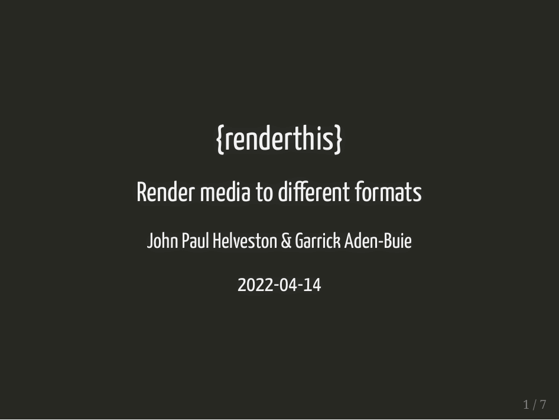

---
output:
  github_document:
    html_preview: false
---

<!-- README.md is generated from README.Rmd. Please edit that file -->

```{r setup, include = FALSE}
knitr::opts_chunk$set(
  collapse = TRUE,
  results = "asis",
  echo = FALSE,
  comment = "#>",
  out.width = "100%"
)
IS_README <- TRUE
```

## xaringanBuilder 

Build xaringan slides into the following formats:

- html
- pdf
- gif
- png thumbnail of first slide
- pptx

## Installation

Install from github:
```
remotes::install_github("jhelvy/xaringanBuilder")
```

## Usage
```
library(xaringanBuilder)
```

Build html from Rmd file ([view example html slides](https://jhelvy.github.io/xaringanBuilder/inst/example/slides.html)):
```
build_html("slides.Rmd")
```

Build pdf from Rmd or html file ([view example pdf slides](https://jhelvy.github.io/xaringanBuilder/inst/example/slides.pdf)):
```
build_pdf("slides.Rmd")
build_pdf("slides.html")
```

Build gif from Rmd, html, or pdf file:
```
build_gif("slides.Rmd")
build_gif("slides.html")
build_gif("slides.pdf")
```
Example:



Build first slide thumbnail from Rmd or html file:
```
build_thumbnail("slides.Rmd")
build_thumbnail("slides.html")
```
Example:


Build pptx from Rmd, html or pdf file:
```
build_pptx("slides.Rmd")
build_pptx("slides.html")
build_pptx("slides.pdf")
```

Build everything except for pptx (html, pdf, gif, and thumbnail of first slide) from Rmd file:
```
build_all("slides.Rmd", include = c("html", "pdf", "gif", "thumbnail"))
```

## Author, Version, and License Information

- Author: *John Paul Helveston* [www.jhelvy.com](http://www.jhelvy.com/)
- Date First Written: *September 27, 2020*
- Most Recent Update: `r format(Sys.Date(), format="%B %d %Y")`
- License: [MIT](https://github.com/jhelvy/xaringanBuilder/blob/master/LICENSE.md)

## Citation Information

If you use this package in a publication, I would greatly appreciate it if you cited it. You can get the citation information by typing `citation("xaringanBuilder")` into R:

```{r}
citation("xaringanBuilder")
```
